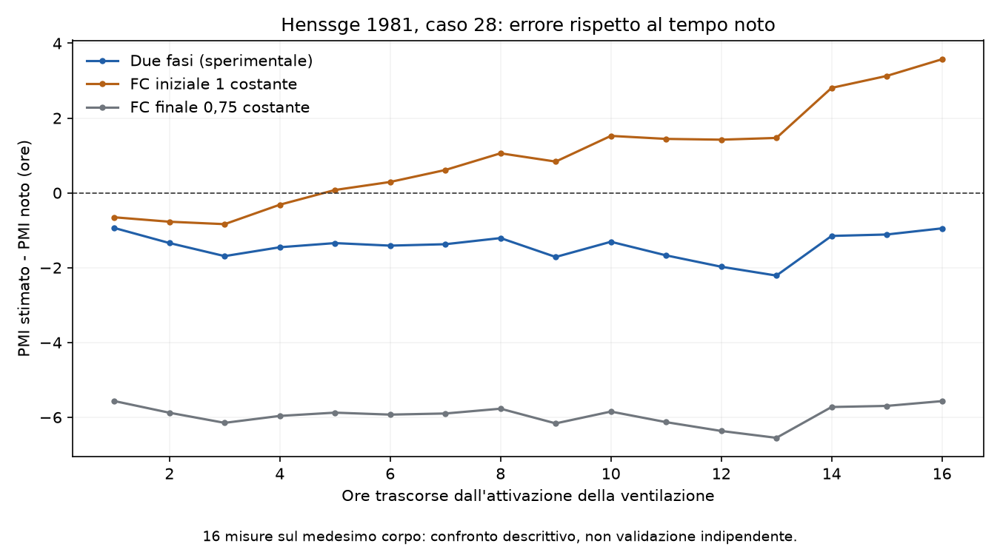

# Prototipo sperimentale: due fasi di raffreddamento

**Stato: ricerca numerica, non integrata nell'app e non validata per l'uso sul caso reale.**

Riferimento esclusivo: branch `refactor-tanatology-keys`, commit di partenza
`ed1780de025d6ac8eb887d97ec10cb61e64f1263`. Nessuna modifica a formule, testi,
grafici, componenti o chiavi di stato dell'app. Nessun FC viene applicato al pannello.

Il prototipo riguarda due condizioni successive nel tempo, non due ipotesi alternative.
Richiede peso, FC delle due fasi, temperatura rettale finale, temperatura ambiente
costante e durata nota della seconda fase. I FC forniti devono essere gia adattati
al peso: il prototipo non ripete la correzione del peso effettuata dall'helper.

**Fonti e distinzione tra riproduzione ed estensione**

- Henssge C. (1981), *Z Rechtsmed* 87:147-178,
  [DOI 10.1007/BF00204763](https://doi.org/10.1007/BF00204763).
  Tabella 3, p. 157; applicazione della formula III, pp. 159-162.
- Henssge C. (1988), *Forensic Sci Int* 38:209-236,
  [DOI 10.1016/0379-0738(88)90168-5](https://doi.org/10.1016/0379-0738(88)90168-5).
  Esperimenti con cambiamento di condizioni, pp. 216-219;
  limiti pratici dei cambiamenti, pp. 231-232.

Il lavoro del 1981 calcola la durata della seconda fase usando la temperatura
rettale misurata al cambiamento. A p. 162 l'autore limita esplicitamente la
trasferibilita pratica del procedimento: nell'esperimento erano noti il momento
del cambiamento, l'epoca del decesso e la temperatura al cambiamento. La
semplificazione esponenziale riguarda una fase tardiva, quando il termine che
descrive la formazione iniziale del gradiente termico e trascurabile.

La nostra estensione ricostruisce invece una temperatura al cambiamento NON
misurata, utilizzando la durata nota della seconda fase. Questa inversione e
matematicamente possibile, ma la sua validita generale sul caso reale non e
dimostrata dai due articoli. Non vengono assegnati intervalli di confidenza o
limiti di errore clinici trasferiti dal metodo ordinario.

**Calcolo**

Il coefficiente B e ottenuto dalla funzione esistente `cooling_coefficient`:

`B = 0.0284 - 1.2815 * (peso * FC)^(-0.625)`.

Formula III, con ambiente costante e tempo espresso in ore:

`T_finale = Ta + (T_cambio - Ta) * exp(B_seconda_fase * durata_seconda_fase)`.

La nostra inversione e:

`T_cambio = Ta + (T_finale - Ta) * exp(-B_seconda_fase * durata_seconda_fase)`.

La temperatura ricostruita viene passata al calcolo attuale di Henssge con il FC
della prima fase. Al tempo ottenuto viene aggiunta la durata della seconda fase.
La temperatura al decesso predefinita e 37,2 C; puo essere specificata esplicitamente.

Il file `reference.py` riutilizza senza modifiche i corpi delle funzioni numeriche
dell'app in uno spazio privato. Questo evita di eseguire `app/__init__.py`, che
installa componenti Streamlit durante un normale import. Non vengono alterati
`sys.modules`, sessioni Streamlit o sorgenti. Gli hash dei sorgenti usati sono
registrati nel riepilogo. I risultati senza cambiamento di FC e con seconda fase
di durata nulla coincidono esattamente con il calcolo attuale non arrotondato.

**Limiti del prototipo e controlli numerici**

- Temperatura ambiente unica, nell'intervallo 0-23 C scelto per questo prototipo.
  Variazioni di temperatura ambiente e il ramo oltre 23 C non sono implementati.
- Differenza rettale-ambiente di almeno 2 C per la ricostruzione esplorativa.
  Le righe della pubblicazione sotto tale valore rimangono riproducibili nel
  controllo della formula originale, ma non generano una nuova stima di PMI.
- Durate non negative, FC e peso positivi nel ramo di raffreddamento decrescente.
  La temperatura ricostruita non puo superare quella iniziale assunta.
- Orizzonte di 160 ore, limite computazionale del calcolo attuale.
- Per A=1,25 il rapporto fra il valore assoluto del secondo termine esponenziale
  e il primo al cambiamento e `r = 0.2 * exp(4 * B_prima_fase * t_prima_fase)`.
  Se supera 0,01 il risultato temporale viene trattenuto. **L'1% e una scelta
  numerica esplicita e regolabile, non una soglia clinica di Henssge per la fine
  del plateau.** Il rapporto riguarda la temperatura, non direttamente la
  derivata della curva o lo stato termico dei tessuti. Superare il controllo
  non dimostra l'assenza di un transitorio al cambiamento.
- Tutte le ricostruzioni a due fasi restano contrassegnate come sperimentali.
  Il supporto matematico a FC differenti non costituisce validazione per
  rimozione delle coperture, bagnatura, immersione o altri cambiamenti.
- Nessuna media temporale dei FC, nessun FC equivalente e nessuna apertura o
  modifica del pannello FC dell'app.

**Confronto con il caso 28 della tabella 3**

Corpo di 65 kg; ambiente 12,4 C; prima fase senza vestiti in aria ferma;
ventilazione attivata a 22 ore dal decesso. Temperatura misurata al cambiamento:
20,3 C. FC impiegati nel confronto: 1 prima e 0,75 dopo il cambiamento.

La riproduzione della formula pubblicata, usando il B stampato di -0,0845,
restituisce **19/19 valori tabulati** arrotondando al passo successivo di 0,2 ore.
Si verifica cosi la lettura e l'implementazione della formula. L'arrotondamento
serve solo a riprodurre la tabella e non e usato nella nuova ricostruzione.

Il confronto principale usa le prime 16 osservazioni della seconda fase,
da 23 a 38 ore dal decesso. Le tre righe successive, stampate fra parentesi
nell'originale, restano nei dati e nel CSV ma sono escluse dal riepilogo
principale. Le misure a 40 e 44 ore sono inoltre sotto la soglia di 2 C e non
producono una nuova stima. **Sono osservazioni ripetute sullo stesso corpo,
non 16 o 19 casi indipendenti.**

| Metodo | Errore assoluto medio | Errore medio con segno | Estremi degli errori |
| --- | ---: | ---: | ---: |
| Estensione a due fasi | 1,43 h | -1,43 h | da -2,21 a -0,94 h |
| FC iniziale 1 per tutto il periodo | 1,30 h | +0,98 h | da -0,84 a +3,57 h |
| FC finale 0,75 per tutto il periodo | 5,94 h | -5,94 h | da -6,55 a -5,57 h |

Errore = PMI stimato meno PMI noto: un errore negativo indica sottostima del
tempo trascorso dal decesso. Il metodo a due fasi non migliora sempre il
risultato: in questo confronto l'errore assoluto medio e leggermente superiore
a quello ottenuto mantenendo il FC iniziale; l'errore massimo assoluto e invece
inferiore. Applicare il FC finale a tutto il periodo produce errori maggiori.
Non e stata aggiunta alcuna correzione empirica per compensare la sottostima.



Esempio a 28 ore dal decesso: temperatura misurata 17,2 C, ventilazione da 6 ore.
Il prototipo ricostruisce 20,370 C al cambiamento e un PMI di 26,589 ore.
La differenza rispetto al tempo noto e circa -1,41 ore.

**Riproducibilita e verifiche**

Eseguire dalla radice del repository, con le dipendenze gia previste dal progetto:

```bash
python -m research.fc_two_phase.compare
python -m research.fc_two_phase.model --rectal 17.2 --ambient 12.4 --weight 65 --fc-before 1 --fc-after 0.75 --hours-after-change 6
python -m unittest discover -s tests -p test_fc_two_phase_prototype.py -v
```

`compare` rigenera CSV, riepilogo JSON e grafici PNG/SVG. Il comando per un singolo
caso produce JSON; termina con codice 2 se il calcolo e fuori ambito o viene
trattenuto dal controllo numerico. Non produce un intervallo di confidenza.

I test coprono la tabella pubblicata, le identita con il calcolo attuale, i casi
incompatibili, la fase iniziale, l'import senza Streamlit e casi sintetici di
andata/ritorno. Questi ultimi verificano soltanto la correttezza numerica.
Verifica locale: 216 test Python superati, inclusi i 17 del prototipo; controlli
JavaScript superati, compresi 3385 controlli su 33600 combinazioni dell'helper FC.
Il diff contiene esclusivamente questa cartella sperimentale e il nuovo file
di test. Nessun file preesistente dell'app e stato modificato.

I risultati non sostengono ancora l'inserimento di una ponderazione temporale
automatica del FC nell'app. Servono ulteriori casi indipendenti e una verifica
specifica del transitorio e delle incertezze di tempi, temperature e FC.
